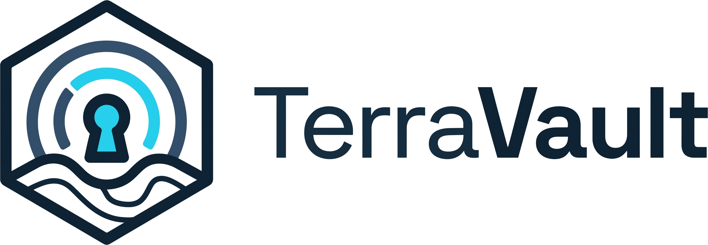
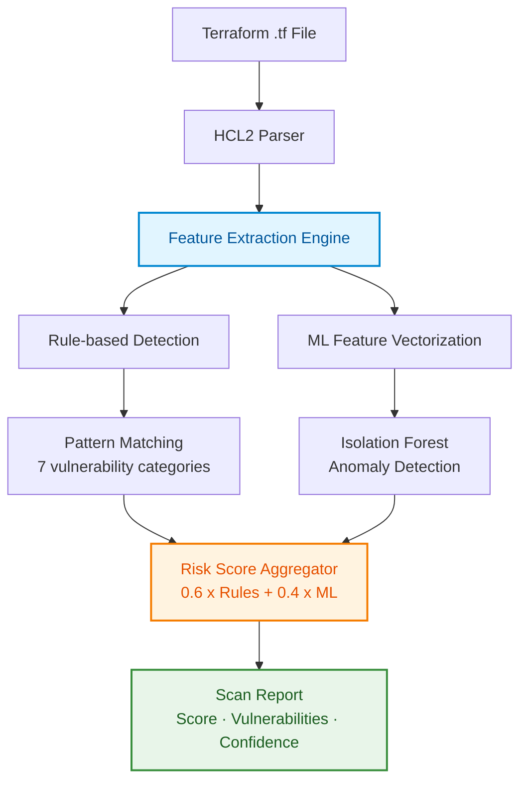
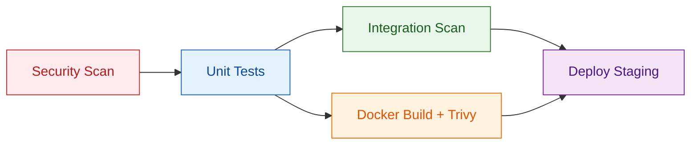
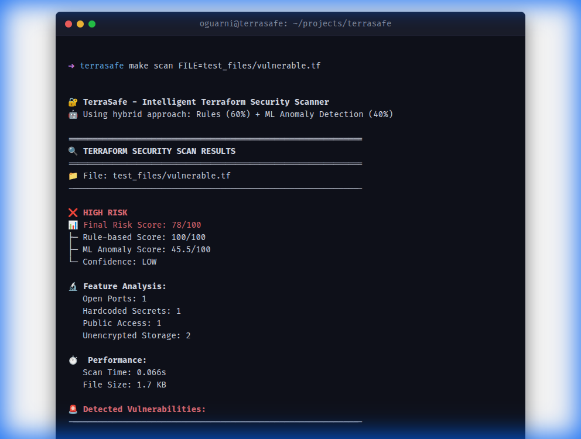
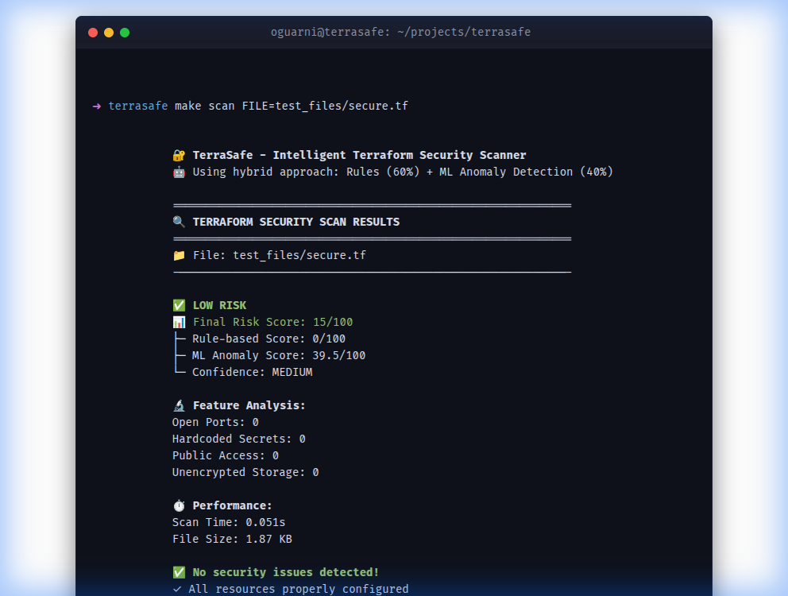
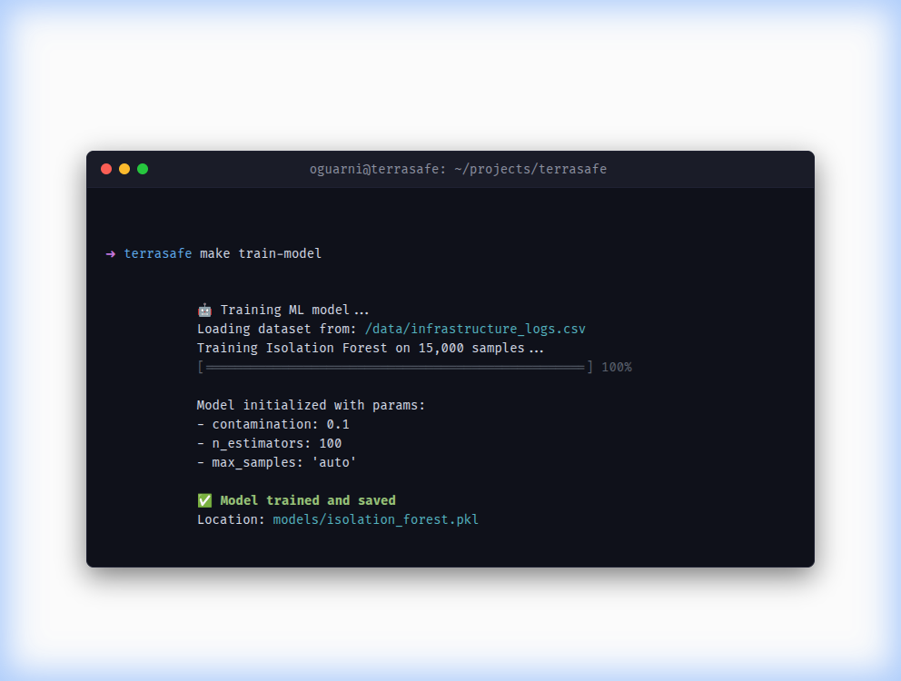
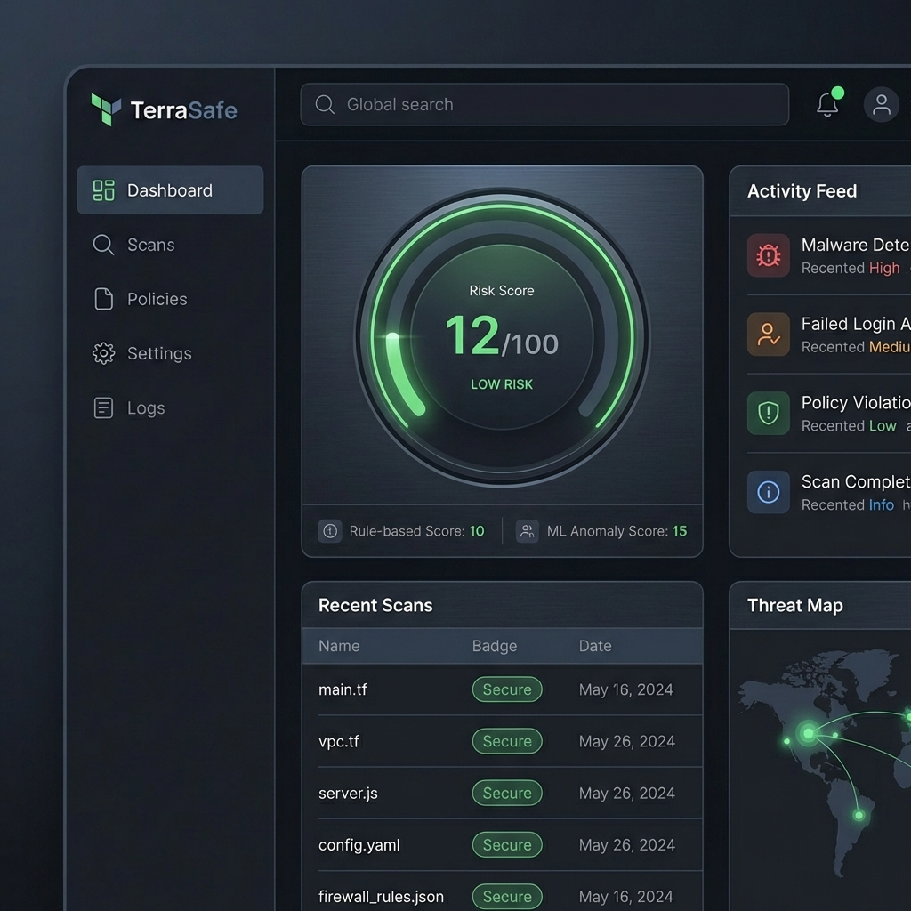

<div align="center">
  

  **Hybrid Terraform Security Scanner — Deterministic Rules + ML Anomaly Detection**

  [](https://www.python.org/)
  [](tests/)
  [](tests/)
  [](https://pylint.pycqa.org/)
  [](https://bandit.readthedocs.io/)
  [](LICENSE)
  [](https://fastapi.tiangolo.com/)

  <br>

  Catch Terraform misconfigurations, hardcoded secrets, and risky infrastructure patterns before they reach production. TerraVault pairs **7 deterministic detection rules** with **Isolation Forest anomaly detection** to surface both known violations and deviations from learned secure baselines.

</div>

---

### Highlights

- **Hybrid scoring** — 60% rule-based + 40% ML anomaly detection. Deterministic rules for known risks, Isolation Forest for everything else
- **Fast enough for CI gating** — sub-second per-file scans — no meaningful pipeline latency
- **Operable API** — FastAPI with bcrypt API keys, Redis rate limiting, async I/O, Prometheus metrics, correlation IDs
- **Measured quality** — 72 focused pytest cases, 74% line coverage (1,518 SLOC), Pylint 10.00/10, 0 Flake8 issues, 0 Bandit findings, 0 Safety advisories

---

## Table of Contents

- [Features](#features)
- [Quick Start](#quick-start)
- [Architecture](#architecture)
- [CLI Usage](#cli-usage)
- [REST API](#rest-api)
- [Quality Metrics](#quality-metrics)
- [DevSecOps Pipeline](#devsecops-pipeline)
- [Docker Deployment](#docker-deployment)
- [Monitoring & Observability](#monitoring--observability)
- [Technology Stack](#technology-stack)
- [Screenshots](#screenshots)
- [Academic Context](#academic-context)
- [Limitations & Future Work](#limitations--future-work)
- [References](#references)
- [License](#license)

---

## Features

### Security Scanner
- Pattern matching for **7 vulnerability categories**: open ports, hardcoded secrets, unencrypted storage, public S3 buckets, IAM misconfigurations, missing CloudWatch logging, and missing VPC flow logs
- Severity classification: `CRITICAL` · `HIGH` · `MEDIUM` · `LOW` · `INFO`
- Actionable remediation suggestions per finding
- Configurable severity overrides for organizational policy alignment

### Machine Learning Engine
- **Isolation Forest** anomaly detection (unsupervised — no labeled data required)
- 7-dimensional feature vector: open ports, hardcoded secrets, public access, unencrypted storage, missing logging, missing flow logs, resource count
- Model persistence via Joblib with versioning and drift detection
- Confidence scoring based on anomaly distance from learned security baselines

### REST API
- FastAPI with OpenAPI/Swagger docs at `/docs`
- Bcrypt-hashed API key authentication
- Redis-backed caching and rate limiting (with in-memory fallback)
- Async file processing with configurable timeouts
- Prometheus metrics at `/metrics`
- Correlation ID tracing for all requests

### DevSecOps
- GitHub Actions CI/CD with 5-stage pipeline
- SAST (Bandit), dependency scanning (Safety), secret detection (GitLeaks)
- Docker image security scan (Trivy)
- Pre-commit hooks for local development
- SBOM generation (CycloneDX)

---

## Quick Start

### Prerequisites
- Python 3.10+
- Git

### Installation

```bash
# Clone the repository
git clone https://github.com/oguarni/terravault.git
cd terravault

# Install everything (creates venv, installs deps)
make install
```

### Run the Demo

```bash
# Scan all three test configurations
make demo

# Or scan a specific file
python -m terravault.cli test_files/vulnerable.tf
python -m terravault.cli test_files/secure.tf
python -m terravault.cli test_files/mixed.tf
```

### Run Tests

```bash
make test          # All tests
make coverage      # With coverage report
make lint          # Code quality (Pylint + Flake8)
make security-scan # Bandit SAST + Safety dependency check
```

> For full API setup with Docker, database, and monitoring, see the **[Quick Start Guide](QUICKSTART.md)**.

---

## Architecture

TerraVault follows **Clean Architecture** with strict layer separation:

```
terravault/
├── domain/            # Business rules, severity levels, vulnerability models
├── application/       # Use cases — IntelligentSecurityScanner orchestrator
├── infrastructure/    # Adapters — HCL parser, ML model, database, cache
├── config/            # Settings (Pydantic), structured logging
├── cli.py             # Command-line interface (text/json/sarif output)
├── api.py             # FastAPI REST server
└── metrics.py         # Prometheus instrumentation
```

### Scan Pipeline



### Scoring System

| Weight | Component | Method |
|--------|-----------|--------|
| **60%** | Rule-based | Deterministic pattern matching — CRITICAL (30pts), HIGH (20pts), MEDIUM (10pts), LOW (5pts), INFO (2pts) |
| **40%** | ML Anomaly | Isolation Forest deviation from learned security baseline |

**Score ranges:** `0-30` Secure · `31-60` Review recommended · `61-100` Critical action required

---

## CLI Usage

```bash
# Scan a Terraform file
python -m terravault.cli <path-to-file.tf>

# Scan via Makefile
make scan FILE=test_files/vulnerable.tf

# JSON output for CI integration
python -m terravault.cli --output-format json --threshold 50 file1.tf file2.tf

# SARIF output for GitHub Code Scanning
python -m terravault.cli --output-format sarif file.tf
```

### Example Output — Vulnerable Configuration

```
TerraVault - Intelligent Terraform Security Scanner
Using hybrid approach: Rules (60%) + ML Anomaly Detection (40%)

============================================================
TERRAFORM SECURITY SCAN RESULTS
============================================================
File: test_files/vulnerable.tf

HIGH RISK
Final Risk Score: 81/100
  Rule-based Score: 100/100
  ML Anomaly Score: 54.7/100
  Confidence: LOW

Detected Vulnerabilities:
[CRITICAL] Open security group - SSH port 22 exposed to internet
   Resource: web_sg
   Fix: Restrict SSH access to specific IP ranges

[CRITICAL] Hardcoded password detected
   Resource: Database/Instance
   Fix: Use variables or secrets manager for sensitive data

[HIGH] Unencrypted RDS instance
   Resource: main_db
   Fix: Enable storage_encrypted = true

[HIGH] Unencrypted EBS volume
   Resource: data_volume
   Fix: Enable encrypted = true

[HIGH] S3 bucket with public access enabled
   Resource: public_bucket
   Fix: Enable all public access blocks
```

### Example Output — Secure Configuration

```
LOW RISK
Final Risk Score: 18/100
  Rule-based Score: 0/100
  ML Anomaly Score: 46.0/100
  Confidence: LOW

No security issues detected!
  All resources properly configured
  Encryption enabled where required
  Network access properly restricted
```

---

## REST API

### Start the API Server

```bash
# Local development
make api

# Production (Docker)
docker-compose up -d
```

### Endpoints

| Method | Endpoint | Auth | Description |
|--------|----------|------|-------------|
| `GET` | `/health` | No | Health check with DB and rate limiter status |
| `POST` | `/scan` | API Key | Scan a Terraform file (rate limited: 10/min) |
| `GET` | `/metrics` | No | Prometheus metrics |
| `GET` | `/docs` | No | OpenAPI/Swagger UI |

### Scan via curl

```bash
curl -X POST \
  -H "X-API-Key: YOUR_API_KEY" \
  -F "file=@terraform.tf" \
  http://localhost:8000/scan
```

### Scan via Python

```python
import requests

response = requests.post(
    "http://localhost:8000/scan",
    headers={"X-API-Key": "YOUR_API_KEY"},
    files={"file": open("terraform.tf", "rb")}
)
print(response.json())
```

### Response Format

```json
{
  "file": "vulnerable.tf",
  "score": 85,
  "rule_based_score": 90,
  "ml_score": 75.5,
  "confidence": "HIGH",
  "vulnerabilities": [
    {
      "severity": "CRITICAL",
      "points": 20,
      "message": "Hardcoded AWS credentials detected",
      "resource": "aws_instance.web",
      "remediation": "Use AWS IAM roles or environment variables"
    }
  ],
  "summary": { "critical": 1, "high": 2, "medium": 0, "low": 0 },
  "performance": { "scan_time_seconds": 0.234, "file_size_kb": 1.5, "from_cache": false }
}
```

> Generate API keys with `python scripts/generate_api_key.py`. See **[QUICKSTART.md](QUICKSTART.md)** for full API setup.

---

## Quality Metrics

> All metrics from the latest full local run — **April 16, 2026**.

| Category | Metric | Result |
|----------|--------|--------|
| **Testing** | Test suite | **72 tests** — 72 passed, 0 skipped |
| **Testing** | Code coverage | **74.11%** across 24 measured modules (1,518 statements) |
| **Code Quality** | Pylint score | **10.00 / 10** |
| **Code Quality** | Flake8 | **0 issues** |
| **Code Quality** | Codebase size | 1,518 measured statements (3,352 non-blank lines) |
| **Security** | SAST (Bandit) | **0 issues** — 0 High, 0 Medium, 0 Low |
| **Security** | Dependencies (Safety) | **0 vulnerabilities** |

---

## DevSecOps Pipeline

GitHub Actions pipeline with 5 stages:



| Stage | Tool | Purpose |
|-------|------|---------|
| **SAST** | Bandit | Static code analysis for Python security issues |
| **Dependencies** | Safety | Known vulnerability check for all pip packages |
| **Secrets** | GitLeaks | Detect hardcoded secrets and credentials |
| **Container** | Trivy | Docker image vulnerability scanning |
| **Coverage** | Codecov | Test coverage tracking and reporting |

### Local Security Scanning

```bash
make security-scan   # Run all security checks
make security-deps   # Dependency vulnerabilities only
make security-sast   # SAST only
make setup-hooks     # Install pre-commit hooks
```

---

## Docker Deployment

### Quick Run

```bash
# Build and scan
docker build -t terravault:latest .
docker run --rm -v /path/to/terraform:/scan:ro terravault:latest /scan/main.tf
```

### Full Stack (docker-compose)

```bash
docker-compose up -d
```

| Service | Port | Purpose |
|---------|------|---------|
| **terravault-api** | 8000 | FastAPI application |
| **PostgreSQL** | 5432 | Persistent scan storage |
| **Redis** | 6379 | Caching and rate limiting |
| **Prometheus** | 9090 | Metrics collection |
| **Grafana** | 3000 | Dashboards and visualization |

The Docker image runs as a **non-root user** with `--read-only` filesystem and `--security-opt=no-new-privileges` recommended.

---

## Monitoring & Observability

- **Prometheus** scrapes `/metrics` every 10s — scan rates, cache hits, latencies, error rates
- **Grafana** dashboard (`TerraVault Overview`) with pre-configured panels:
  - Scan rate and cache hit ratio
  - Vulnerability distribution by severity and category
  - P95/P99 scan duration
  - API request latency and error rates
- **Structured JSON logging** with correlation IDs for request tracing
- **Health check** endpoint at `/health` with database connectivity status

---

## Technology Stack

| Component | Technology | Purpose |
|-----------|------------|---------|
| Language | Python 3.10+ | ML ecosystem, clean syntax |
| ML Framework | scikit-learn (Isolation Forest) | Unsupervised anomaly detection |
| Parser | python-hcl2 | Native Terraform HCL2 parsing |
| API Framework | FastAPI + Uvicorn | Async REST API with OpenAPI docs |
| Database | PostgreSQL + SQLAlchemy (async) | Scan history persistence |
| Cache | Redis | LRU caching, rate limiting |
| Auth | bcrypt | API key hashing |
| Monitoring | Prometheus + Grafana | Metrics and dashboards |
| Containers | Docker + Docker Compose | Multi-service deployment |
| CI/CD | GitHub Actions | DevSecOps automation |
| Numerical | NumPy | Feature vector operations |
| Model Persistence | Joblib | Serialized scikit-learn models |

---

## Screenshots

<p align="center">
  <h3>Vulnerability Detection</h3>
  
</p>

<p align="center">
  <h3>Secure Infrastructure Analysis</h3>
  
</p>

<p align="center">
  <h3>ML Model Training</h3>
  
</p>

<p align="center">
  <h3>Grafana Monitoring Dashboard</h3>
  
</p>

---

## Academic Context

| | |
|---|---|
| **Course** | Capstone Project I and II |
| **Institution** | Federal University of Technology - Parana (UTFPR) |
| **Program** | B.S. in Software Engineering, 8th Semester |
| **Type** | Technical Report |

### Why Isolation Forest?

Isolation Forest was selected after evaluating alternatives against four practical criteria: suitability for unlabeled data (labeled Terraform misconfiguration datasets are scarce), efficiency on structured configuration inputs, performance with limited training samples, and output interpretability.

| Criterion | Isolation Forest | Neural Networks | Genetic Algorithms | Decision Trees |
|-----------|:---:|:---:|:---:|:---:|
| Unsupervised (no labels) | Strong | Weak | N/A | Weak |
| Efficient on structured data | Strong | Overkill | Misaligned | Moderate |
| Small-sample performance | Strong | Weak | Moderate | Moderate |
| Explainable output | Strong | Weak | Moderate | Strong |

### Design Rationale

1. **Hybrid detection** — Deterministic rules catch known misconfigurations with zero false negatives against their patterns; Isolation Forest adds coverage for deviations the ruleset has not seen. The signals are complementary, not redundant.
2. **Evolving baseline** — The model refines its security baseline as more configurations are analyzed. Drift detection flags distributional shifts so operators know when a retrain is warranted.
3. **Explainable scoring** — Every finding ships with its feature vector, rule attribution, and confidence level. Results are auditable, not black-box.
4. **CI-compatible performance** — Sub-second per-file latency makes security gating a viable step in deployment pipelines rather than an offline batch job.

---

## Limitations & Future Work

### Current Limitations
- Baseline training data is synthetic; real-world distributions may differ
- No support for Terraform modules or remote state
- Vulnerability messages and remediation guidance in English only
- AWS coverage only; Azure and GCP provider patterns are not yet encoded

### Roadmap
- Multi-cloud coverage (Azure, GCP) with provider-specific rule packs
- Terraform module and remote-state analysis
- Custom policy definition language for organizational rules
- Deeper ML models evaluated against the current Isolation Forest baseline
- Integration with cloud provider native security APIs (AWS Config, etc.)

---

## References

- Gartner (2024). *Cloud Security Failures Report*
- IBM Security (2024). *Cost of a Data Breach Report*
- HashiCorp. *Terraform Security Best Practices*
- Liu, F. T., Ting, K. M., & Zhou, Z. H. (2008). *Isolation Forest*. In Proceedings of the Eighth IEEE International Conference on Data Mining (ICDM '08)

---

## License

Copyright (C) 2025-2026 Gabriel Felipe Guarnieri. All rights reserved.

This project is dual-licensed under the **AGPL-3.0 + Commercial License** model:

- **Open-source use**: Licensed under the [GNU Affero General Public License v3.0 (AGPL-3.0)](LICENSE).
- **Commercial use**: A proprietary commercial license is available for use cases incompatible with the AGPL-3.0. See [LICENSE-COMMERCIAL.md](LICENSE-COMMERCIAL.md) for details.

> **Retroactive clause**: This license applies retroactively to all past commits and versions of this repository, superseding any previously stated license.

For commercial licensing inquiries, contact the author via [LinkedIn](https://www.linkedin.com/in/oguarni/).

---

<div align="center">

  Developed by **Gabriel Felipe Guarnieri** — UTFPR Software Engineering

  [Quick Start Guide](QUICKSTART.md) · [API Documentation](http://localhost:8000/docs) · [Report an Issue](https://github.com/oguarni/terravault/issues)

</div>
